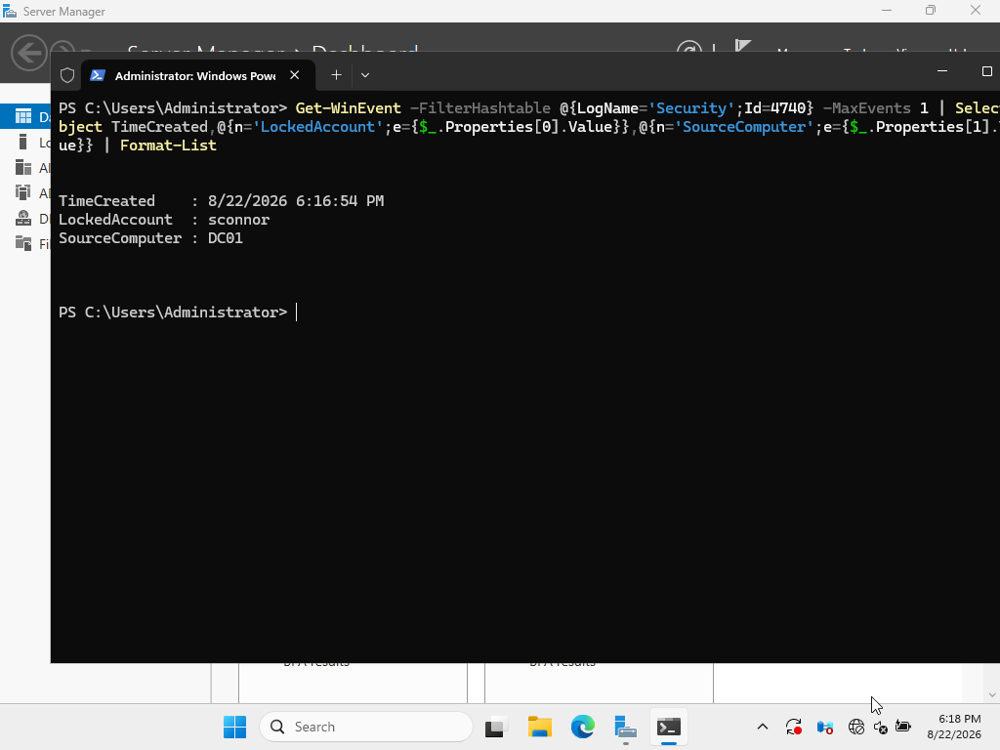
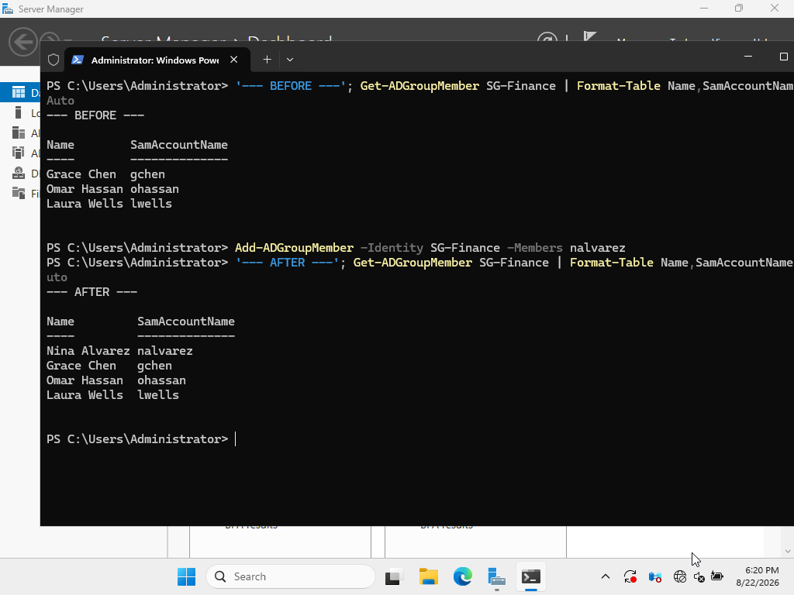
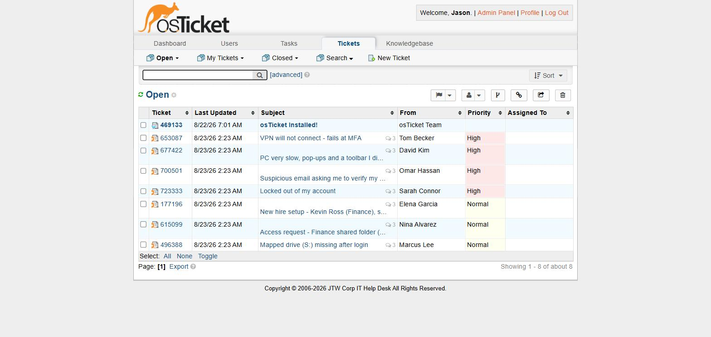
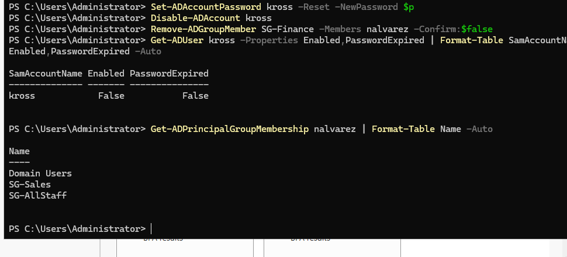

# Help Desk & IT Support Lab — osTicket + Active Directory

A self-hosted support environment combining osTicket with an isolated Active Directory lab.
The project demonstrates service-desk investigation, ticket documentation, user communication,
escalation judgment, account administration, and reusable troubleshooting guidance.

The completed portfolio package includes seven synthetic ticket records, five knowledge-base
runbooks, three executed Active Directory support exercises, a verification matrix, and an
artifact-level evidence manifest.

> **Privacy and scope:** every person, name, account, message, and ticket in this repository is
> synthetic and exists only for the lab. No production user, customer, or help-desk data is
> included.

For a fast review, use the one-page **[verification matrix](docs/verification-matrix.md)**. For
artifact-level provenance, hashes, and limitations, use the complete **[evidence
manifest](evidence/README.md)**.

## At a glance

| Area | Evidence-backed scope |
|---|---|
| Active Directory | HD-001 through HD-003 are controlled exercises executed on the lab domain controller; exposed/temporary state from HD-002 and HD-003 was later remediated and verified. |
| Group Policy | HD-004 is a configuration diagnostic: GPO inventory and permissions were inspected, but client-side remediation/application was not verified. |
| Support judgment | HD-005 through HD-007 are illustrative scenarios, not records of live incidents or executed remediations. |
| Ticketing platform | osTicket was installed and configured, then populated with synthetic case-study records. Screenshots show those records as **Open / Unassigned**, not closed or resolved. |
| Documentation | Seven ticket narratives and five reusable knowledge-base articles demonstrate troubleshooting structure, user communication, and escalation reasoning. |

## Environment

```text
       VirtualBox internal network "intnet" (10.10.10.0/24)

  ┌──────────────────────────┐       ┌───────────────────────────┐
  │ DC01                     │       │ helpdesk                  │
  │ Windows Server / AD DS   │       │ Ubuntu Server 24.04 LTS  │
  │ DNS / jtwyman.test       │       │ Apache + MariaDB + PHP   │
  │ 10.10.10.10              │       │ osTicket / 10.10.10.30   │
  └──────────────────────────┘       └───────────────────────────┘

  Windows 11 client: planned/pending; not used as evidence in this repository.
```

* The observed lab build used **osTicket 1.18.4** on **Ubuntu Server 24.04 LTS** with
  Apache, MariaDB, and PHP 8.3.
* The Active Directory prerequisite is maintained in the companion
  **[Active Directory Home Lab](https://github.com/jasontwyman/active-directory-home-lab)**.
* The steady-state design uses only the VirtualBox internal network. A NAT adapter was used
  temporarily for installation and then removed. This is a lab isolation measure, not a claim
  that production network controls were implemented.
* The final host-side VirtualBox query reports `nic1="none"`, `nic2="intnet"`, and
  `intnet2="intnet"`; the sanitized output is preserved in
  [`evidence/config/helpdesk-vm-network.txt`](evidence/config/helpdesk-vm-network.txt).
* A Windows 11 endpoint is intentionally not shown as domain joined because this repository
  does not contain evidence proving that state or client-side GPO application.

For the reproducible **osTicket portion**, assuming the AD lab already exists, see the
**[build guide](docs/build-guide.md)**.

## Case-study records

The Markdown write-ups describe the intended investigation and outcome of each synthetic case.
The osTicket screenshots are seeded records used to present those cases; they remain visibly
**Open / Unassigned**. Accordingly, this README does not treat the osTicket records themselves
as closed or resolved.

| # | Case | Classification | What the evidence supports |
|---|---|---|---|
| [HD-001](tickets/HD-001-account-lockout.md) | Account lockout | **Executed live AD exercise** | Controlled lockout, Event ID 4740 review, and account unlock on the lab domain. |
| [HD-002](tickets/HD-002-new-hire-onboarding.md) | New-hire setup | **Executed live AD exercise** | Synthetic account creation and group assignment on the lab domain. |
| [HD-003](tickets/HD-003-access-request-group-membership.md) | Finance access request | **Executed live AD exercise** | Controlled group-membership change and before/after review. |
| [HD-004](tickets/HD-004-mapped-drive-gpo.md) | Missing mapped drive | **Configuration diagnostic** | GPO inventory and security-filtering configuration were inspected. No client `gpresult`, mapped-drive check, or post-change endpoint validation is captured, so remediation remains unverified. |
| [HD-005](tickets/HD-005-vpn-mfa.md) | VPN/MFA failure | **Illustrative scenario** | Troubleshooting reasoning and a model user response; no live VPN or MFA system was exercised. |
| [HD-006](tickets/HD-006-slow-pc-malware-escalation.md) | Suspected malware | **Illustrative scenario** | Triage, evidence-preservation, and escalation reasoning; no live malware event or security handoff was executed. |
| [HD-007](tickets/HD-007-phishing-escalation.md) | Phishing report | **Illustrative scenario** | Reporting, preservation, and escalation reasoning; no live phishing event or response workflow was executed. |

Each case uses a consistent service-desk structure: summary, impact/priority, investigation,
reasoning, proposed or executed action, user communication, escalation decision, and follow-up.
In each ticket file, **Exercise outcome** describes the narrative/lab result while **Captured
osTicket state** records the separate workflow state visible in the preserved ticketing capture.

## Selected evidence

These representative screenshots are embedded for a quick review. The full set is indexed in the
**[evidence manifest](evidence/README.md)**; it is supporting evidence, not a step-by-step record
of every action.

### HD-001 — controlled lockout source shown in Security Event ID 4740



### HD-003 — synthetic access-group membership before and after the exercise



### osTicket — seeded synthetic case-study queue (records remain Open / Unassigned)



### Post-review AD cleanup — account disabled and temporary membership removed



## Evidence boundaries

* **Executed configuration is not the same as end-user validation.** AD commands and their
  output support HD-001 through HD-003. They do not prove that a user signed in, accessed a
  share, or completed a first-logon password change unless endpoint evidence shows it.
* **GPO scope is not GPO application.** `Get-GPO` and `Get-GPPermission` support the HD-004
  configuration diagnosis, but no client `gpresult`/RSoP output or mapped-drive validation is
  present. The proposed remediation is therefore unverified.
* **Narrative outcomes are not osTicket workflow states.** The case documents may describe an
  intended resolution or escalation, while the captured osTicket records remain Open and
  Unassigned. One detail capture shows response metadata but not its content or author; the
  screenshots do not prove that the Markdown communication templates were sent, nor do they prove
  assignment, escalation, closure, or SLA completion.
* **Illustrative scenarios are not executed incidents.** HD-005 through HD-007 demonstrate
  analysis and documentation only. They do not prove operation of a VPN, MFA provider,
  malware-analysis process, mail gateway, or Security team handoff.
* **Screenshots are selective.** They support specific visible states and commands; they do not
  cover every step or establish production readiness.
* **Post-review cleanup changed live AD state.** The exposed onboarding credential was reset
  using an undisclosed `SecureString` value, `kross` was disabled, and `nalvarez` was removed
  from `SG-Finance`. Screenshot 18 shows the reset invocation without a visible error and the
  final queried account/group state, but it does not independently verify the replacement value
  or its generation method.
* **Lab hardening is incomplete.** HTTPS, a documented host-firewall policy, tested backups and
  restores, monitoring, and production secret management were not implemented or evidenced.
  They are listed in the build guide as production-hardening follow-up, not completed controls.

## Knowledge base

* [KB-001 — Account lockouts: find the source and unlock](knowledge-base/KB-001-account-lockouts.md)
* [KB-002 — New-hire onboarding checklist](knowledge-base/KB-002-new-hire-onboarding-checklist.md)
* [KB-003 — VPN + MFA connection troubleshooting](knowledge-base/KB-003-vpn-mfa-troubleshooting.md)
* [KB-004 — Reporting and handling suspected phishing](knowledge-base/KB-004-phishing-response-runbook.md)
* [KB-005 — Suspected-malware triage and escalation](knowledge-base/KB-005-malware-escalation-runbook.md)

## Production-hardening follow-up (not implemented)

Before adapting this lab design to a real environment, add and test HTTPS with managed
certificates, an explicit host/network firewall policy, encrypted backups with restore tests,
monitoring and alerting, patch/change management, durable secret management, and appropriate
email controls. None of those production controls should be inferred from this repository.
